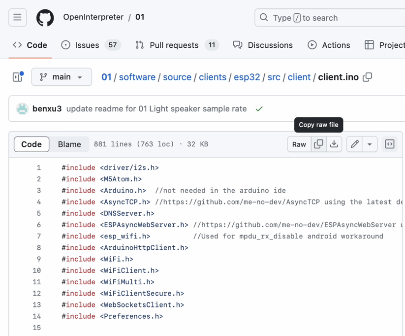
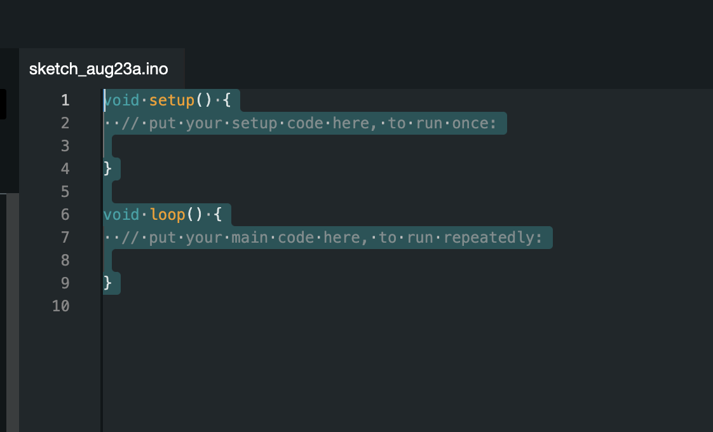
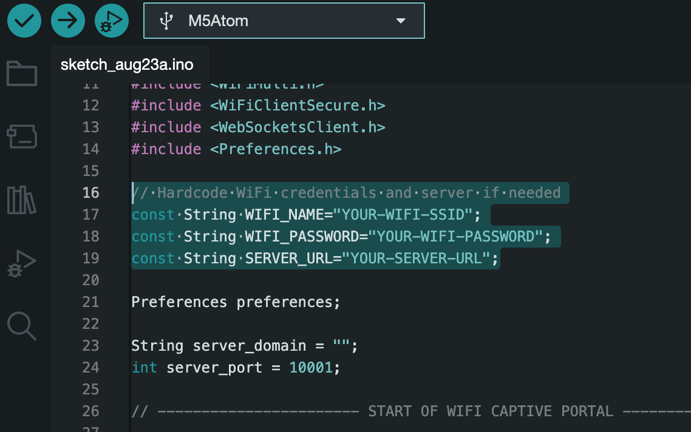
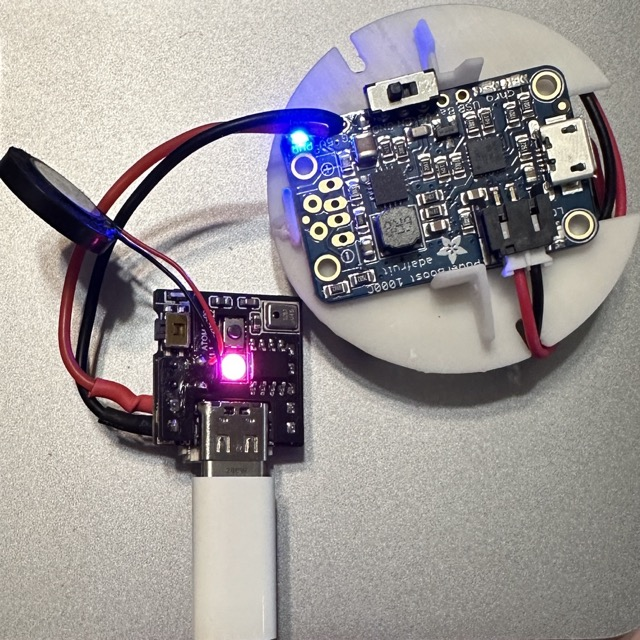
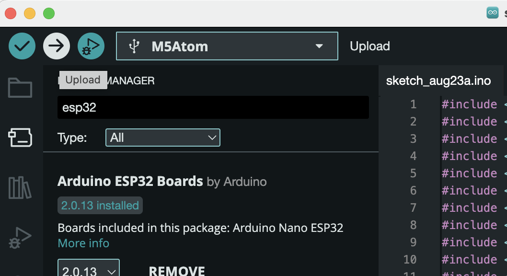

To set up the ESP32 for use with 01, follow this guide to install the firmware:

1. Download [Arduino IDE](https://www.arduino.cc/en/software).

2. Get the firmware by copying the contents of [client.ino](https://github.com/OpenInterpreter/01/blob/main/software/source/clients/esp32/src/client/client.ino) from the 01 repository.

  

3. Open Arduino IDE and paste the client.ino contents.

  

  

4. Hardcode your WiFi SSID, WiFi password, and server URL into the code. 

  

  

    Hardcoding is recommended for a more streamlined setup and development environment. However, if you don't hardcode these values or if the ESP32 can't connect using the provided information, it will automatically default to a captive portal for configuration. 
  

5. Go to Tools -> Board -> Boards Manager, search "esp32", then install the boards by Arduino and Espressif.

  

5. Go to Tools -> Manage Libraries, then install the following:

- M5Atom by M5Stack ([Reference](https://www.arduino.cc/reference/en/libraries/m5atom/))

  

  

- WebSockets by Markus Sattler ([Reference](https://www.arduino.cc/reference/en/libraries/websockets/))

  

- AsyncTCP by dvarrel ([Reference](https://github.com/dvarrel/AsyncTCP))

  

- ESPAsyncWebServer by lacamera ([Reference](https://github.com/lacamera/ESPAsyncWebServer))

  

  

6. To flash the .ino to the board, connect the board to the USB port.

  

7. Select the port from the dropdown on the IDE, then select the M5Atom board (or M5Stack-ATOM if you have that).

  

8. Click on upload to flash the board.

  

---

Watch this video from Thomas for a step-by-step guide on flashing the ESP32 and connecting the 01.

